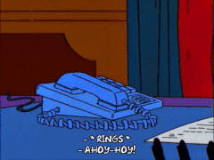

# Ahoyhoy!

## About Me

My name is Orace (you can call me Ora if you like).

I'm a 🛡 security researcher and a network engineer affiliated with the Emessarl labs in Cotonou, Benin.

Here is a tl;dr for you:
- 🇧🇯️ I'm a proud Beninese
- 🔭 I’m currently working on eBPF applications for network controler congestion.
- ✨ I’m looking to collaborate on anything related to Python, C, Linux, eBPF, or OS security.
- 📫 How to reach me:
  - email: oracekpakpo0@gmail.com
- 😄 Pronouns: He/Him

